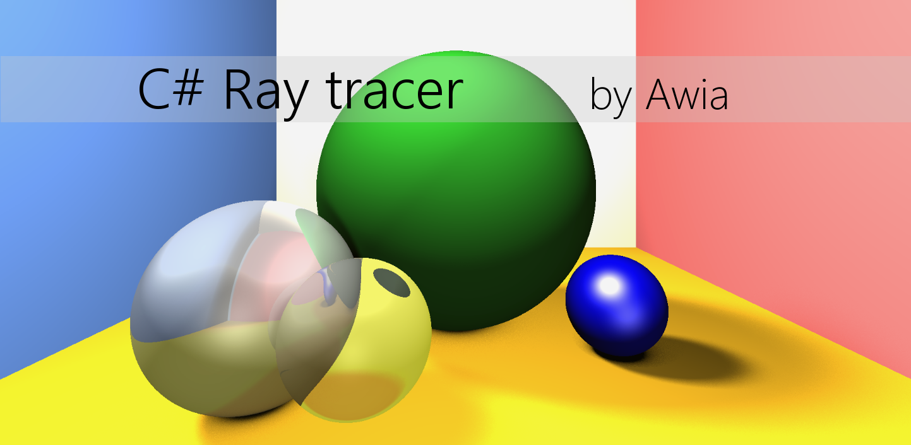

Ray Tracing
===============

This repository serves as a hub for all ray tracing implementations I make. Currently both a Java and a C# application exists.
The "Runnable Builds" folder includes the latest working builds.

C# Application
------------
###Features
 - WPF async GUI
 - Reflection
 - Refraction
 - Multithreading
 - Shaders (Flat, Diffuse and Specular)
 - Lights(Ambient, Directional and Local) 
 - Soft Shadows.

###Design
The project was build with readability, maintainability and ease of extending in mind. Most modules have interfaces and new implementations should be easy to add. Furthermore the project is in MVVM form, such that building another GUI should be easy.

###Planned Extensions
- A dynamic camera, since the direction of the current camera cannot be changed.
- Depth of field.
- Optimization on Soft Shadows
- Creating CRUD functionality to the GUI such that the user can change the scene.

Java Application
------------

###Features
 - Shaders (Flat, Diffuse and Specular)
 - Lights(Ambient, Directional) 

###Planned Extensions
None at the moment, since I focus on the C# project
